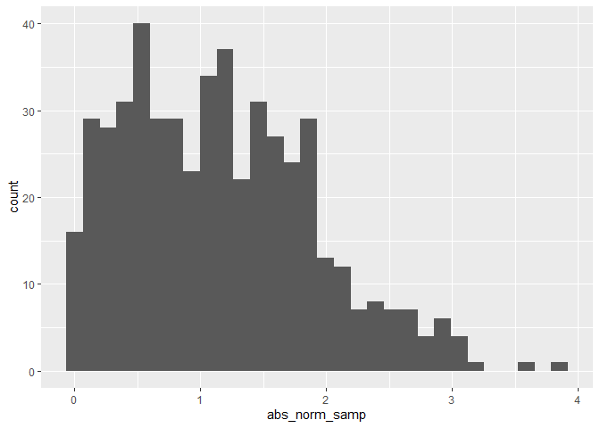

Simple document
================
Lu Qiu
2023-09-12

I’m an R Markdown document!

# Section 1: First code chunk

Here’s a **code chunk** that samples from a *normal distribution*:

``` r
samp = rnorm(100)
length(samp)
```

    ## [1] 100

The mean of the sample is -0.0629

# Section 2: Make a plot

This code is borrowed from last lecture; it creates a dataframe for
plotting.

``` r
plot_df = 
  tibble(
    x = rnorm(1000, sd = 0.5),
    y = 1 + 2 * x + rnorm(1000),
    y2 = 1 + 2 * x + 4 * x^2 + rnorm(1000)
  )
```

Next up is a histogram of the `x` variable in the `plot_df`.

``` r
ggplot(plot_df, aes(x = x)) + geom_histogram()
```

    ## `stat_bin()` using `bins = 30`. Pick better value with `binwidth`.

<!-- -->

Lastly, I will do a scatterplot.

``` r
ggplot(plot_df, aes(x = x , y = y)) + geom_point()
```

<!-- --> Here’s a
list:

- This is a list
- This is another list

# Section 3: Learning assessment

The chunk below creates a dataframe containing a sample of size 500 from
a random normal variable, constructs the specified logical vector, takes
the absolute value of each element of that sample,and produces a
histogram of the absolute value. The code chunk also finds the median of
the sample and stores it for easy in-line printing.

``` r
la_df = 
  tibble(
    norm_samp = rnorm(500, mean = 1),
    log_vec = norm_samp >= 0,
    abs_norm_samp = abs(norm_samp)
  )
ggplot(la_df, aes(x = abs_norm_samp)) + geom_histogram()
```

    ## `stat_bin()` using `bins = 30`. Pick better value with `binwidth`.

<!-- -->

# Section 4: Text formatting

*italic* or *italic* **bold** or **bold** `code` superscript<sup>2</sup>
and subscript<sub>2</sub>

## Headings

# 1st Level Header

## 2nd Level Header

### 3rd Level Header

## Lists

- Bulleted list item 1

- Item 2

  - Item 2a

  - Item 2b

1.  Numbered list item 1

2.  Item 2. The numbers are incremented automatically in the output.

## Tables

| First Header | Second Header |
|--------------|---------------|
| Content Cell | Content Cell  |
| Content Cell | Content Cell  |
